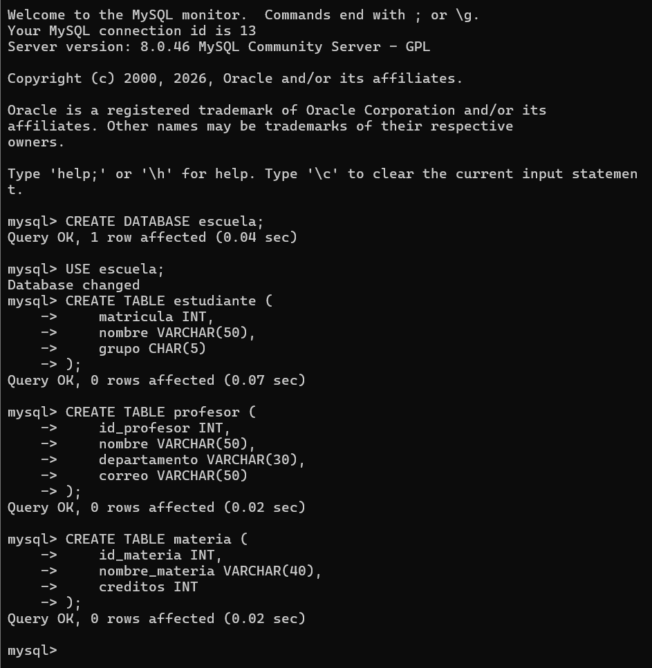

# Evidencias de la Práctica

## Creación de la Base de Datos y Tablas
Aquí se muestra la ejecución de los comandos en MySQL para crear la base de datos escuela y las tablas estudiante, profesor y materia.

